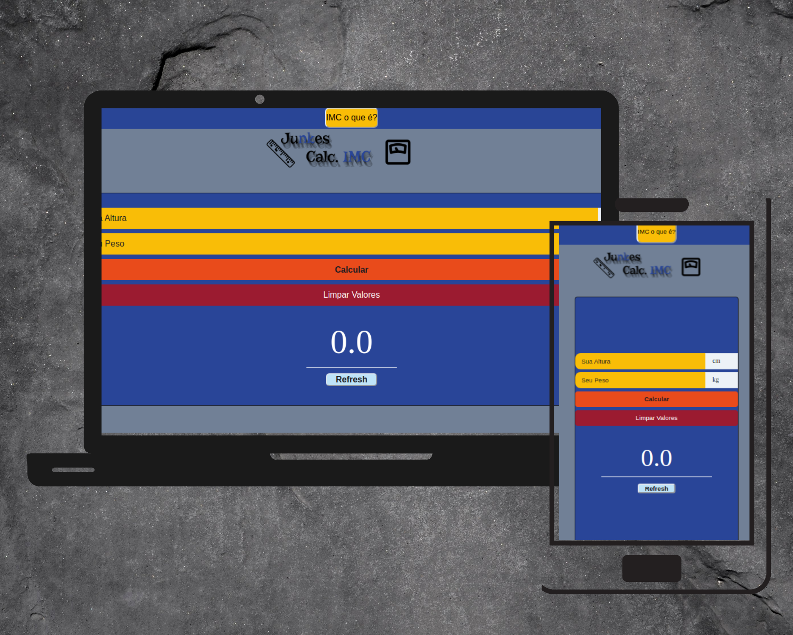
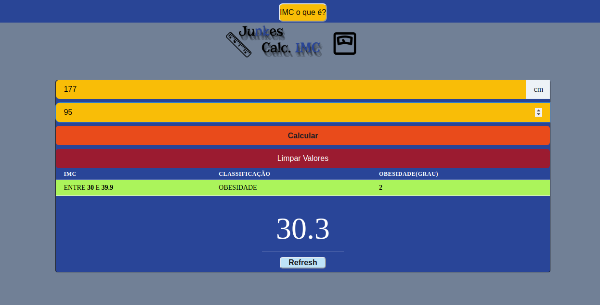

# Junkes Cálculadora IMC

## Preview





## Sobre o IMC Calc.

Mais um exemplo simples e interessante, novas tecnologias(react-js, next-js, chakra-ui), conheça a calculadora IMC(índice de massa corporal), coloque sua altura, seu peso, e veja o resultado.

## Installation

Clone o repositório com `git clone https://github.com/Leojunkes/calculo_IMC-next`

 ```cd calculo_IMC-next``` ```npm start ou yarn``` para salvar as dependências.

## License

This project is licensed under the MIT License - see the LICENSE.md file for details.
